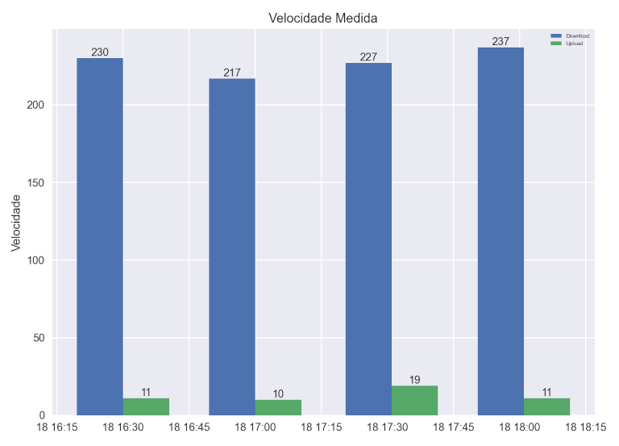

# Speedtest-Log

O Speedtest-log tem por obtivo realizar testes periódicos da conexão de internet, guardando seus resultados em arquivo .csv e com a possibilidade de gerar representação gráfica.

Para tanto, utiliza a biblioteca `speedtest-cli` para os testes de *Download* e *Upload*.

Requisitos em *requirements.txt*

## Imagens de tela

### Execução dos testes:
```
Informe a quantidade de testes: 4
Informe o intervalo de tempo em horas: 0.5
----- Executando o 1º teste -----
Data: 18-04-2021 16:30
Velocidade de Download: 230.74
Velocidade de Upload: 11.11
----- Executando o 2º teste -----
Data: 18-04-2021 17:00
Velocidade de Download: 217.26
Velocidade de Upload: 10.88
----- Executando o 3º teste -----
Data: 18-04-2021 17:31
Velocidade de Download: 227.01
Velocidade de Upload: 19.27
----- Executando o 4º teste -----
Data: 18-04-2021 18:01
Velocidade de Download: 237.58
Velocidade de Upload: 11.1
-------- Resumo dos Resultados --------
            Horário  Download   Upload
1  18-04-2021 16:30  230.7411  11.1134
2  18-04-2021 17:00  217.2631  10.8807
3  18-04-2021 17:31  227.0067  19.2713
4  18-04-2021 18:01  237.5840  11.0968
Deseja exibir um gráfico com os resultados? [S/N] s
```


### Resultado em gráfico:

